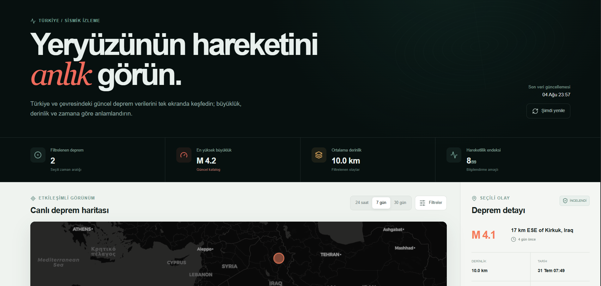
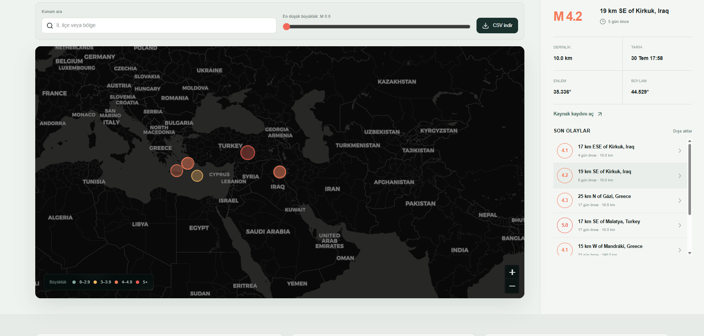
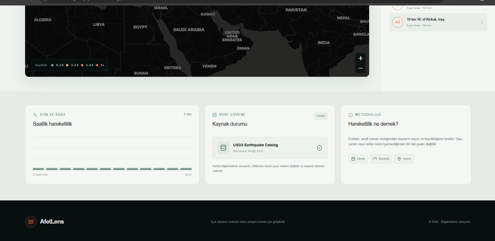
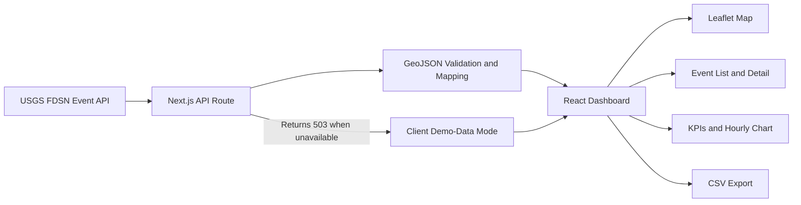

<div align="center">

# AfetLens

### An open-source web application that turns current earthquake data around Türkiye into an accessible decision-support interface

[Open Live Application](https://afetlens-tr.grassy-yew-2997.chatgpt.site/) ·
[Türkçe](README.md) · English


</div>

---

> [!IMPORTANT]
> **AfetLens is not an official early-warning system and does not predict earthquakes.**  
> All data and activity indicators are provided for informational purposes only.

## Overview

AfetLens presents current USGS Earthquake Catalog records through an interactive map, a filterable event list, and accessible summary indicators.

The goal is not merely to list raw seismic records. It helps users examine events in one interface through the context of **time, location, magnitude, and depth**.

[Open the live demo](https://afetlens-tr.grassy-yew-2997.chatgpt.site/)

---

## Product Preview



The primary view:

- Displays the latest data-update time
- Summarises the number of events in the selected range
- Calculates maximum magnitude and average depth
- Presents an experimental activity index
- Shows magnitude, depth, date, and coordinates for the selected event

---

## Map, Filtering, and CSV Export



Users can:

- Switch between `24 hours`, `7 days`, and `30 days`
- Search by city, district, or region name
- Change the minimum-magnitude threshold
- Select records through map markers or the event list
- Open the original USGS record
- Download the filtered result as a UTF-8 CSV file

Marker colour and size change according to magnitude. Events of `M 4.0+` receive stronger visual emphasis.

---

## Analysis and Data Trust



The analysis area:

- Groups activity from the last 24 hours into two-hour buckets
- Displays the active source and latest check time
- Explains the meaning of the activity index
- Explicitly states that the index is not a risk score

### Activity index

The index combines event count and magnitude within the selected period into one experimental indicator.

It does not include:

- Building stock
- Local ground conditions
- Population density
- Fault-segment analysis
- Damage or casualty estimation

It must therefore **not be interpreted as a hazard, risk, or early-warning score.**

---

## System Architecture



---

## Data Flow

The server-side API route:

- Requests the latest **30 days** of records
- Uses latitude bounds `34.5–43.0` and longitude bounds `24.0–46.5`
- Orders results by event time
- Requests at most **600 events** per call
- Converts USGS GeoJSON into the application's simplified data model
- Preserves each source URL and USGS review status

When the live source is unavailable, the API returns `503`. The client keeps the interface demonstrable through local records that are explicitly labelled as **Demo data**.

---

## Core Features

- Current data from the USGS Earthquake Catalog
- Coordinate bounds focused on Türkiye and nearby regions
- Dark interactive Leaflet map
- Magnitude-based marker colour and size
- Selected-event details
- Recent-event list
- Time, location, and minimum-magnitude filters
- Hourly activity chart
- CSV export
- Visible source status
- Clearly labelled demo-data fallback
- Responsive desktop and mobile interface
- Live Cloudflare-compatible deployment

---

## Technology Stack

### Frontend

- Next.js 16
- React 19
- TypeScript
- Tailwind CSS
- Lucide React
- React Leaflet
- Leaflet
- CARTO map layers

### Data and deployment

- USGS FDSN Event Web Service
- Next.js API Route
- GeoJSON
- Vinext
- Vite
- Cloudflare Workers
- Wrangler

### Quality

- ESLint
- Production-build validation
- Rendered-HTML test
- TypeScript types

---

## Quick Start

Node.js `22.13.0` or newer is required.

```bash
git clone https://github.com/BurakKocDev/AfetLens.git
cd AfetLens
npm install
npm run dev
```

The application opens at:

```text
http://localhost:3000
```

### Checks

```bash
npm run lint
npm run build
npm test
```

`npm test` creates a production build and checks that the primary application content is rendered.

---

## Repository Structure

```text
AfetLens/
├── app/
│   ├── api/earthquakes/   # USGS data route
│   ├── components/        # Dashboard and interactive map
│   ├── globals.css        # Visual system
│   └── page.tsx           # Main application
├── tests/                 # Rendered-HTML validation
├── docs/
│   └── assets/afetlens/   # README screenshots
├── package.json
├── README.md
└── README.en.md
```

---

## Data Source

Live events are retrieved from the [USGS Earthquake Catalog](https://earthquake.usgs.gov/fdsnws/event/1/).

AfetLens:

- Maps source data into a user-friendly structure
- Preserves the original USGS link for each event
- Displays active-source and update information
- Does not hide source failure; demo-data status is explicitly shown

---

## Scope and Limitations

- USGS records depend on catalogue updates and source availability.
- AfetLens does not replace national or local authorities.
- It provides no earthquake prediction, early warning, or damage forecast.
- The coordinate bounds also include nearby events outside Türkiye.
- Location names originate from USGS and may not be in Turkish.
- The activity index is not a scientific risk model.
- Visual density is not equivalent to physical hazard or expected damage.
- In an emergency, users should follow official authority guidance.

---

## Project Goal

AfetLens demonstrates how open seismic data can be presented as an accessible, transparent, and user-friendly modern web product.
