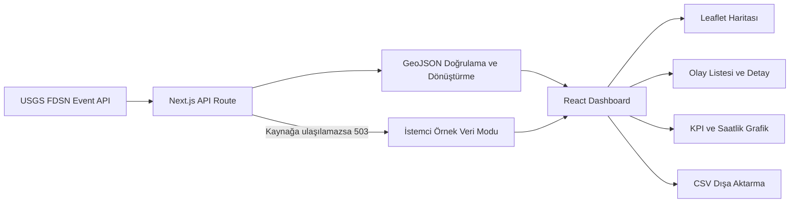

<div align="center">

# AfetLens

### Türkiye ve çevresindeki güncel deprem verilerini anlaşılır bir karar destek arayüzüne dönüştüren açık kaynaklı web uygulaması

[Canlı Uygulamayı Aç](https://afetlens-tr.grassy-yew-2997.chatgpt.site/) ·
Türkçe · [English](README.en.md)


</div>

---

> [!IMPORTANT]
> **AfetLens resmî bir erken uyarı sistemi değildir ve deprem tahmini yapmaz.**  
> Sunulan veriler ve hareketlilik göstergeleri yalnızca bilgilendirme amaçlıdır.

## Proje Özeti

AfetLens, USGS Earthquake Catalog üzerinden alınan güncel deprem kayıtlarını etkileşimli bir harita, filtrelenebilir olay listesi ve anlaşılır özet göstergelerle sunar.

Uygulamanın amacı ham sismik katalog verisini yalnızca listelemek değil; kullanıcıların olayları **zaman, konum, büyüklük ve derinlik** bağlamında tek ekranda inceleyebilmesini sağlamaktır.

[Canlı demoyu aç](https://afetlens-tr.grassy-yew-2997.chatgpt.site/)

---

## Ürün Görünümü


Ana görünüm:

- Son veri güncelleme zamanını gösterir
- Seçili aralıktaki olay sayısını özetler
- En yüksek büyüklüğü ve ortalama derinliği hesaplar
- Deneysel hareketlilik endeksini sunar
- Haritada seçilen olayın büyüklük, derinlik, tarih ve koordinat bilgilerini gösterir

---

## Harita, Filtreleme ve CSV Dışa Aktarma


Kullanıcılar:

- `24 saat`, `7 gün` ve `30 gün` aralıkları arasında geçiş yapabilir
- İl, ilçe veya bölge adına göre arama yapabilir
- Minimum büyüklük eşiğini değiştirebilir
- Harita işaretleri veya olay listesi üzerinden kayıt seçebilir
- Kaynak USGS kaydını açabilir
- Filtrelenmiş sonucu UTF-8 CSV olarak indirebilir

Harita işaretlerinin rengi ve büyüklüğü olay magnitüdüne göre değişir. `M 4.0+` olaylar görsel olarak daha belirgin sunulur.

---

## Analiz ve Veri Güveni


Alt analiz alanı:

- Son 24 saatteki olayların iki saatlik gruplarla hareketliliğini gösterir
- Aktif veri kaynağını ve son kontrol zamanını belirtir
- Hareketlilik endeksinin ne anlama geldiğini açıklar
- Endeksin bir risk puanı olmadığını özellikle vurgular

### Hareketlilik endeksi

Endeks, seçili zaman aralığındaki olay sayısını ve büyüklüklerini tek bir deneysel gösterge içinde özetler.

Şunları içermez:

- Yapı stoku
- Yerel zemin koşulları
- Nüfus yoğunluğu
- Fay segmenti analizi
- Hasar veya can kaybı tahmini

Bu nedenle endeks **tehlike, risk veya erken uyarı puanı olarak yorumlanmamalıdır.**

---

## Sistem Mimarisi



---

## Veri Akışı

Sunucu tarafındaki API route:

- Son **30 günlük** kayıtları sorgular
- `34.5–43.0` enlem ve `24.0–46.5` boylam sınırlarını kullanır
- Sonuçları zamana göre sıralar
- Tek sorguda en fazla **600 olay** ister
- USGS GeoJSON çıktısını uygulamanın kullandığı sade veri modeline dönüştürür
- Olayın kaynak bağlantısını ve USGS inceleme durumunu korur

Canlı kaynak erişilemezse API `503` döndürür. İstemci, arayüzün işleyişini göstermek için açıkça **Örnek veri** olarak etiketlenmiş yerel kayıtları kullanır.

---

## Temel Özellikler

- USGS Earthquake Catalog üzerinden güncel veri
- Türkiye ve yakın çevresine odaklanan koordinat sınırları
- Koyu temalı etkileşimli Leaflet haritası
- Magnitüde göre renk ve işaret boyutu
- Seçili olay ayrıntıları
- Son olaylar listesi
- Zaman, konum ve minimum büyüklük filtreleri
- Saatlik hareketlilik grafiği
- CSV dışa aktarma
- Kaynak durumunun görünür biçimde gösterilmesi
- Kaynak hatasında etiketli örnek veri modu
- Masaüstü ve mobil uyumlu arayüz
- Canlı Cloudflare uyumlu dağıtım

---

## Kullanılan Teknolojiler

### Frontend

- Next.js 16
- React 19
- TypeScript
- Tailwind CSS
- Lucide React
- React Leaflet
- Leaflet
- CARTO harita katmanları

### Veri ve dağıtım

- USGS FDSN Event Web Service
- Next.js API Route
- GeoJSON
- Vinext
- Vite
- Cloudflare Workers
- Wrangler

### Kalite

- ESLint
- Production build kontrolü
- Rendered HTML testi
- TypeScript tipleri

---

## Hızlı Başlangıç

Node.js `22.13.0` veya daha güncel bir sürüm gereklidir.

```bash
git clone https://github.com/BurakKocDev/AfetLens.git
cd AfetLens
npm install
npm run dev
```

Uygulama varsayılan olarak:

```text
http://localhost:3000
```

adresinde açılır.

### Kontroller

```bash
npm run lint
npm run build
npm test
```

`npm test`, üretim derlemesini oluşturur ve ana uygulama içeriğinin render edildiğini kontrol eder.

---

## Repository Yapısı

```text
AfetLens/
├── app/
│   ├── api/earthquakes/   # USGS veri route'u
│   ├── components/        # Dashboard ve etkileşimli harita
│   ├── globals.css        # Görsel sistem
│   └── page.tsx           # Ana uygulama
├── tests/                 # Rendered HTML kontrolü
├── docs/
│   └── assets/afetlens/   # README ekran görüntüleri
├── package.json
├── README.md
└── README.en.md
```

---

## Veri Kaynağı

Canlı olaylar [USGS Earthquake Catalog](https://earthquake.usgs.gov/fdsnws/event/1/) üzerinden alınır.

AfetLens:

- Veriyi kullanıcı dostu bir yapıya dönüştürür
- Her olay için kaynak USGS bağlantısını korur
- Aktif kaynağı ve son güncelleme zamanını arayüzde gösterir
- Kaynak erişilemiyorsa bunu gizlemez; örnek veri durumunu açıkça belirtir

---

## Kapsam ve Sınırlılıklar

- USGS kayıtları katalog güncellemelerine ve kaynak erişilebilirliğine bağlıdır.
- AfetLens ulusal veya yerel resmî kurumların yerine geçmez.
- Uygulama deprem tahmini, erken uyarı veya hasar tahmini yapmaz.
- Koordinat sınırları Türkiye'nin yanında yakın çevredeki olayları da kapsar.
- Konum adları USGS kaynağından geldiği için Türkçe olmayabilir.
- Hareketlilik endeksi bilimsel bir risk modeli değildir.
- Görsel yoğunluk, fiziksel tehlike veya beklenen hasarla eş anlamlı değildir.
- Acil durumlarda yalnızca resmî kurumların duyuruları takip edilmelidir.

---

## Projenin Amacı

AfetLens, açık sismik verinin modern bir web ürünü içinde nasıl erişilebilir, şeffaf ve kullanıcı dostu biçimde sunulabileceğini göstermeyi amaçlar.
